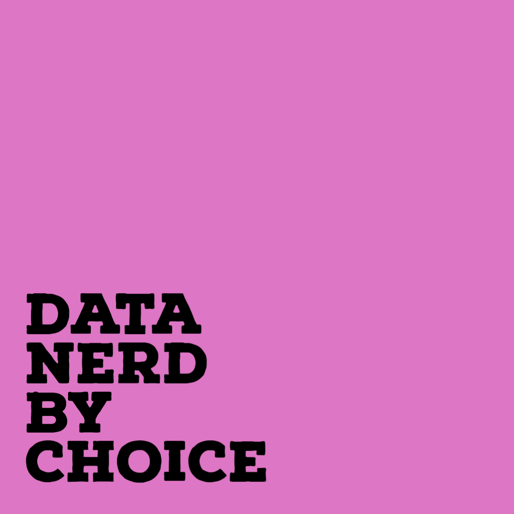

<p align="center" style="font-size: 200%;"><b>Hi 👋 I am Nabeel</b></p>
<p align="center">
    <a href="https://nabeel-io.github.io/blog/index.html" style="color:dodgerblue">blog</a> |
    <a href="https://www.linkedin.com/in/nabeel-hasan-bits00/" style="color:dodgerblue">linkedin</a> |
    <a href="https://www.kaggle.com/floopybits" style="color:dodgerblue">kaggle</a> 
</p>

<p align="center">
</p>

<p align="center">


</p>          


* 👨‍💻 Currently working on `A/B Testing`  and `Time Series` problems.
* 💡 Learning `Quasi-Experiments & Gaussian Process`.
* 🤓 Facinated in findind `Non-normal` within `Normal`.
* 🚴‍♂️ Love to wander in `nature` with my bicycle.
* ✉️ `Reach` me at nabeel.io@outlook.com


<p align="center">
<a href="https://nabeel-io.github.io/blog/index.html"></a>
</p>


**My Skills**

```python
Myskills = {
    "languages": ["Python", "R", "Julia", "Excel", "SQL"],
    "analytical": ["A/B Testing", "Decision Science", "Regression Analysis", "Time Series", "Basket Analysis"],
    "libraries": ["Numpy", "Pandas", "Matplotlib", "ScikitLearn","XgBoost","Requests", "Flask", "Click", "git"],
    "other": ["API Integration", "Orchestration", "Vim", "AWS", "Communication", "Collaboration".]
    }
for key, value in Myskills.items():
    print(key , value)
```
