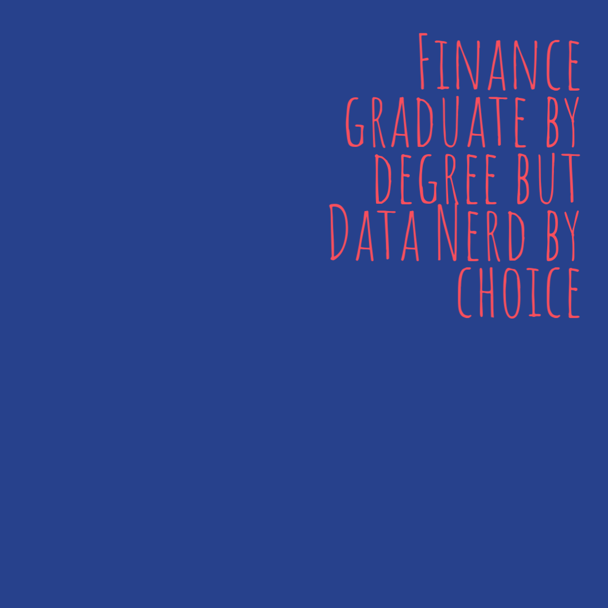

<p align="center" style="font-size: 200%;"><b>Hi 👋 I am Nabeel</b></p>
<p align="center">
    <a href="https://twitter.com/floopybits" style="color:dodgerblue">twitter</a> |
    <a href="https://www.linkedin.com/in/nabeel-hasan-08b2a615a/" style="color:dodgerblue">linkedin</a> |
    <a href="https://www.kaggle.com/floopybits" style="color:dodgerblue">kaggle</a> 
</p>

<p align="center">
</p>

<p align="center">


</p>          


* 👨‍💻 Currently working on `Deep Learning`  and `Time Series` concepts.
* 💡 I am learning `Data Science & ML`.
* 🤓 I strongly believe in `collaborative` learning.
* 🚴‍♂️ Love to wander in `nature` with my bicycle.
* ✉️ `Reach` me at nabeel.io@outlook.com


<p align="center">
<a href="https://nabeel-io.github.io/resume-info/"></a>
<a href="https://github.com/nabeel-io/resume-info"></a>
<a href="https://medium.com/@floopybits"></a>
</p>


**My Skills**

```python
Myskills = {
    "languages": ["Python", "R", "Julia"],
    "databases": ["Postgres", "MySQL"],
    "libraries": ["Keras", "Numpy", "Pandas", "ScikitLearn","Xgboost", "Dplyr", "ggplot2"],
    "other": ["Statistics", "Probability", "Github", "Vim", "Linux"]
    }
for key, value in Myskills.items():
    print(key , value)
```
